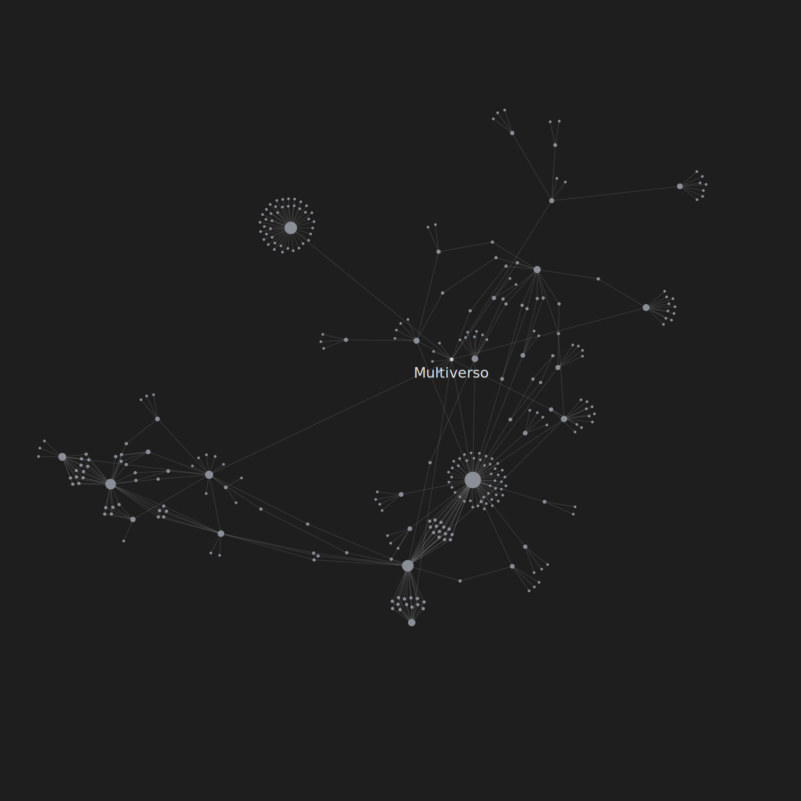
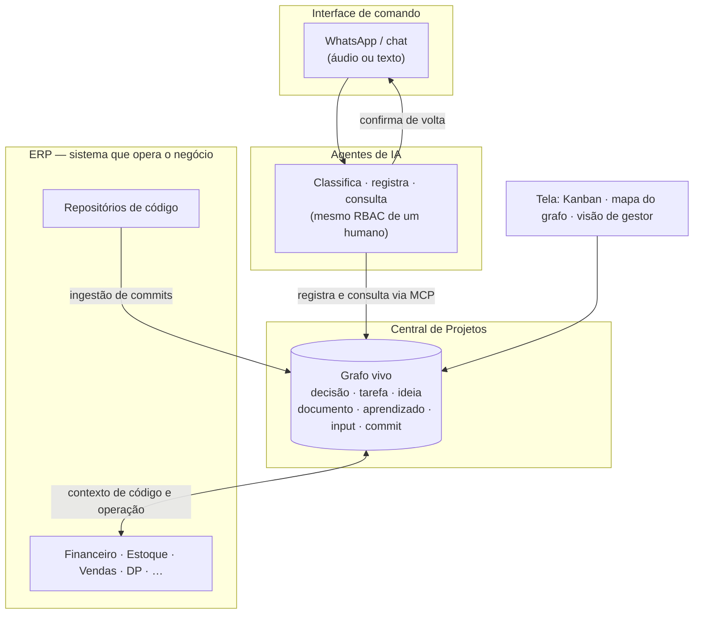

# Central de Projetos

**O cérebro de conhecimento de uma empresa real — um grafo vivo onde cada decisão, tarefa, ideia e commit vira um nó, operado tanto por pessoas quanto por agentes de IA.**

*Este repositório é a vitrine pública do projeto. O código roda em produção e vive em repositórios privados — aqui está o conceito, a arquitetura e a história.*

## O problema

O conhecimento de uma empresa vive espalhado: uma decisão fica num áudio de WhatsApp, a tarefa que ela gerou vai pra uma planilha, o motivo real está num chat que ninguém acha mais, e o aprendizado que custou uma semana some quando a pessoa que resolveu troca de time. Ninguém consegue reconstruir o "por quê" de nada. E o pior: uma IA que entra pra ajudar começa do zero toda vez, sem memória do que já foi decidido.

A Central de Projetos resolve isso invertendo a lógica: **em vez de o conhecimento ser um subproduto do trabalho, ele é a fonte de verdade — e o trabalho passa por ele.**

## A ideia central

Tudo que acontece na empresa vira um **nó** de um grafo vivo: uma **decisão**, uma **tarefa**, uma **ideia**, um **documento**, um **aprendizado**, uma **fala literal** (input), um **commit**. As **arestas** são as relações entre eles — a decisão ligada às tarefas que ela gerou, a tarefa ligada ao commit que a implementou, o commit ligado à conversa que o originou, o aprendizado ligado ao problema que o ensinou.

O resultado é uma memória operacional única. Qualquer pessoa — ou qualquer **agente de IA** — recupera o contexto completo de um assunto em segundos, seguindo as arestas, em vez de garimpar em chats, planilhas e e-mails soltos.

 
<em>A rede de conhecimento real, anonimizada. Cada ponto é um nó (decisão, tarefa, ideia, documento…); cada linha é uma relação. Os aglomerados são projetos densos, com muitas tarefas e decisões ligadas entre si. Sem nenhum dado de negócio — só a <strong>forma</strong> da rede.</em>

## O modelo de nós e arestas

Cada tipo de nó tem uma função única. Eles **não duplicam papel** entre si — é isso que mantém o grafo limpo (o detalhe está em [CONCEITO.md](CONCEITO.md)).

| Nó (entidade) | O que captura | Natureza |
|---|---|---|
| **Decisão** | "É assim que deve ser" — uma regra ou definição tomada | Versionável: uma decisão nova *substitui* a anterior (histórico preservado, nunca sobrescrito) |
| **Tarefa** | Algo a fazer, com status, responsável e andamento | Fluxo de trabalho; carrega o histórico de eventos |
| **Ideia** | Um pensamento solto que ainda não é compromisso | Pode ser promovida a tarefa — ou descartada |
| **Documento** | Conhecimento durável e estruturado (arquitetura, guia, mapa) | Editável, com visibilidade e wikilinks entre docs |
| **Aprendizado** | Um problema resolvido + a lição que ficou | Versionável: a lição evolui e pode ser marcada como superada |
| **Input** | A fala literal de quem falou (áudio transcrito, mensagem) | Append-only — é a proveniência, nunca se reescreve |
| **Commit** | Uma mudança de código ingerida do repositório | Liga o grafo de conhecimento ao grafo de código |
| **Projeto / Agrupamento** | O contêiner hierárquico que organiza os nós | Aninhável; carrega o controle de acesso |

As **arestas** são tipadas: `consome`, `depende`, `integra`, `relacionado`, `substitui`, `origina`. É isso que transforma uma lista de itens numa rede navegável.

## O fluxo: a empresa se opera por mensagem

A porta de entrada não é uma tela — é a **conversa**. A pessoa manda um áudio ou uma mensagem no WhatsApp; um agente de IA classifica o que é (decisão? tarefa? ideia? aprendizado?), grava no nó certo da Central via MCP, e devolve a confirmação. A tela (Kanban, visão de gestor, mapa do grafo) é o complemento visual — não o único caminho.

Dois princípios sustentam o fluxo:

- **Captura-primeiro.** Nada se perde. Toda definição é persistida no ato em que é dita — não "depois, quando der". O que não vira nó, deixa de existir na memória da empresa.
- **Consultar antes de agir.** Antes de decidir ou priorizar, lê-se o grafo primeiro. A Central é fonte de gravação *e* de consulta — não um arquivo morto.

## Operável por IA (MCP + RBAC)

Este é o ponto que muda o jogo. A Central é operada via **MCP (Model Context Protocol)**: os agentes de IA não têm um back-door próprio nem privilégios especiais. Eles usam **as mesmas permissões (RBAC) de um usuário humano.**

- **O que uma pessoa faz na tela, um agente faz por API — e vice-versa.** O mesmo controle de acesso governa os dois. Se uma pessoa não pode ver o financeiro de uma filial, o agente agindo em nome dela também não pode.
- **Acesso granular, estilo grafo de permissões.** O acesso se resolve em camadas independentes: *pode?* (capacidade global), *onde?* (concessão por projeto/tarefa), *o quê?* (visibilidade do conteúdo — o default é privado). Um nó pode ser concedido a uma **pessoa ou a um agente** — os dois são cidadãos de primeira classe.
- **Tudo auditado.** Cada escrita — humana ou de IA — deixa rastro: quem, quando, a partir de qual input. A proveniência é parte do modelo, não um log paralelo.

O efeito prático: os mesmos agentes que ajudam a **construir** o software também **operam** a empresa através dele — registram decisões, movem tarefas, montam relatórios, anotam aprendizados — sem nunca sair do trilho de permissão que vale para qualquer funcionário.

## Por que isso importa

Uma empresa com esse grafo tem três coisas que quase ninguém tem:

1. **Memória que não depende de pessoas.** O "por quê" de cada decisão fica gravado e ligado ao que ele gerou. Ninguém leva o contexto embora ao trocar de time.
2. **IA com contexto de verdade.** Um agente não começa do zero: ele carrega o estado do assunto puxando o grafo, opera dentro das permissões, e grava de volta. O conhecimento acumula em vez de evaporar.
3. **A operação vira dado.** Se toda decisão, tarefa e aprendizado é um nó, então "como a empresa funciona" deixa de ser folclore oral e passa a ser algo que se consulta, audita e melhora.

## História

Construída por uma equipe mínima liderada pelo [César Canal](https://github.com/cesarvcanal), com IA como multiplicador de força. A Central nasceu de uma frustração concreta — decisões e definições se perdendo entre áudios, planilhas e chats — e virou o **destino número um** de toda captura de conhecimento da operação: o lugar onde se grava primeiro e se consulta antes de agir, em qualquer terminal, por qualquer agente.

O objetivo nunca foi vender software. É **eficiência operacional radical** de um atacado real — menos trabalho manual, menos dependência de memória humana, mais decisão apoiada em contexto.

⭐ Se essa ideia te interessa, deixa uma estrela — e explora os [outros pedaços que a gente abriu](https://github.com/cesarvcanal?tab=repositories).

## Mais

- [O modelo de conhecimento em detalhe](CONCEITO.md)
